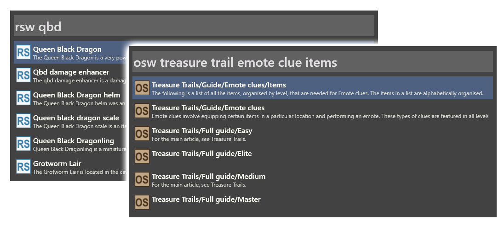

# Wox.Plugin.RuneScapeWiki

Get search results for the [RuneScape Wiki](https://runescape.wiki) or the [Old School RuneScape Wiki](https://oldschool.runescape.wiki) right on your desktop, and open the resulting pages in your browser! Spend less time googling, more time grinding.

### How to get Wox and install this plugin

Full instructions [here](https://github.com/Wox-launcher/Wox/wiki/Getting-started.-Installation) (which includes how to search your computer's files with Wox), but this will get you far enough to use this plugin. Please note that Wox only works on Windows operating systems.

1. Download the latest release from the [Wox releases](https://github.com/Wox-launcher/Wox/releases) (you want the .exe file)
2. At time of writing, there is no install prompt. Run the .exe and wait a few seconds, it will install in the background. You should soon see Wox running in your system tray.
3. Press alt+space (the default Wox hotkey) to open the Wox launcher and type `wpm install RuneScapeWiki`. Hit Enter, and say OK when prompted.
4. You should be prompted to restart Wox once the plugin is installed. After restarting, press alt+space anytime to enter commands into Wox.

You can type `settings` into Wox at anytime to access its configuration. I personally recommend checking these boxes in the settings:

* Start Wox on system startup
* Hide Wox on startup (without this, the Wox bar just kind of hangs around after a restart until you Esc out of it)
* Hide Wox when focus is lost (so you can click out of the Wox bar at any time to make it go away)

### How to use this plugin

* `rsw runite ore` - Search the RuneScape Wiki for 'runite ore'
* `osw zulrah` - Search the Old School RuneScape Wiki 'zulrah'
* Use the up/down arrow keys to navigate through search results. Up to 10 results will be returned for a search.
* Left-click or press Enter to open the highlighted result in your browser.

### Disclaimer

This plugin for Wox is published by Runeberry Software, LLC and released under the [MIT License](https://github.com/dolphinspired/Wox.Plugin.RuneScapeWiki/blob/master/LICENSE). This plugin is not affiliated with [Jagex Ltd.](https://www.jagex.com/) (owners of RuneScape) or [Weird Gloop Ltd.](https://weirdgloop.org/) (owners of these wikis).
